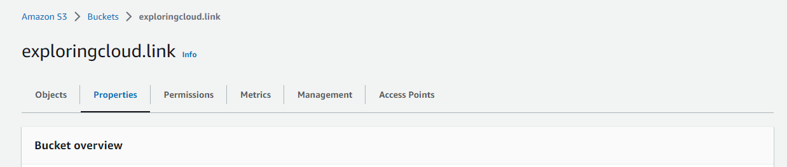
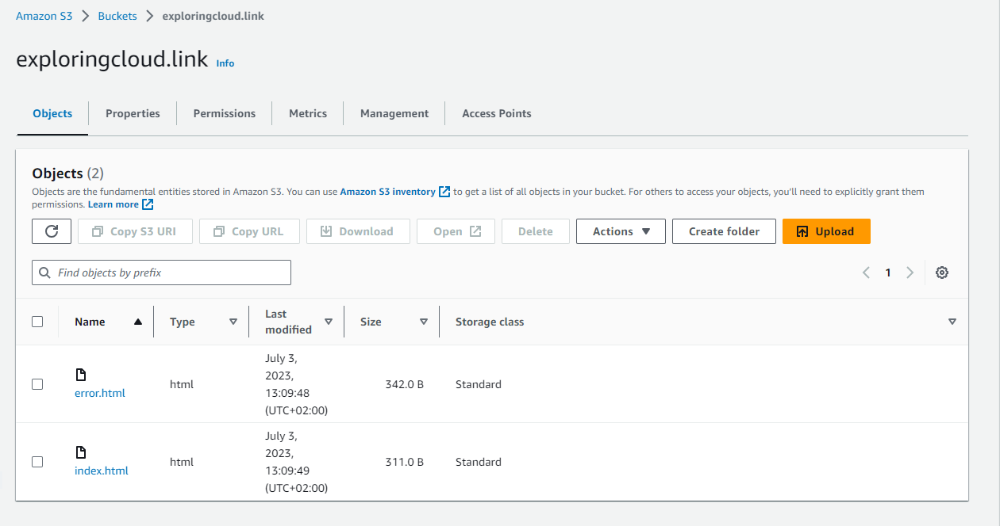
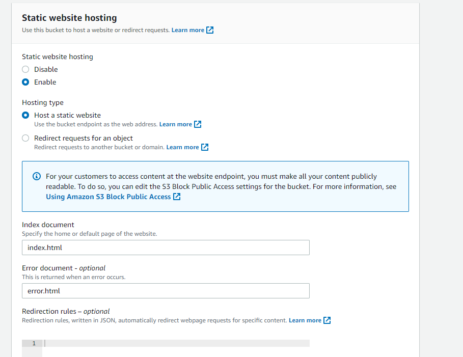
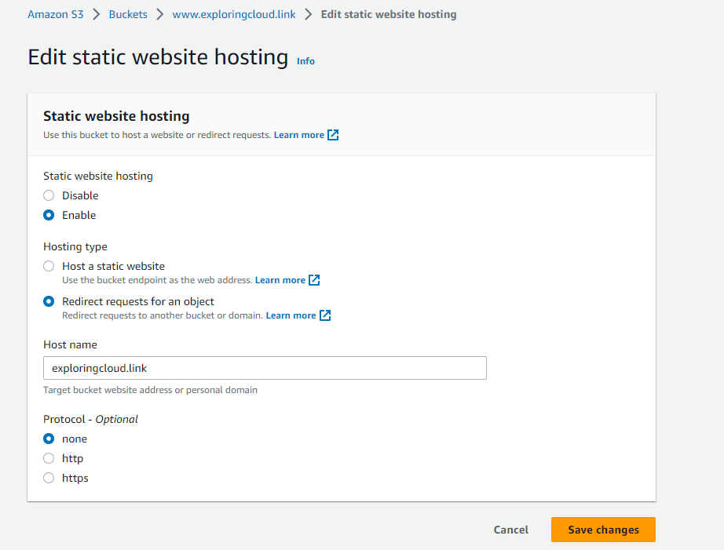
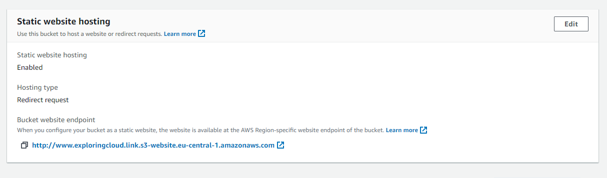

Project Description: Hosting a static website on AWS with Route 53

Technologies used: Route 53, CloudFront, S3 Bucket, AWS Certificate Manager

Section 1: Registering a domain name 
To host a website the first you need a domain name in order to access the website securely

1. Amazon Route 53 is a highly available and scalable Domain Name System (DNS) web service. Route 53 connects user requests to internet applications running on AWS or on-premises.
2. This blog provides detailed steps for registering a domain name with Route 53 [https://docs.aws.amazon.com/Route53/latest/DeveloperGuide/domain-register.html]

Section 2: Create a hosted zone 
A hosted zone is a container for records, and records contain information about how you want to route traffic for a specific domain, such as example.com, and its subdomains (acme.example.com, zenith.example.com).

1. When you purchase a domain name with Amazon Route 53, a hosted zone is automatically created for you.
2. Keep in mind that there is a small cost of 0.50$ per month for this service

Section 3: Create S3 buckets to store our static website files 
Important: Users generally access websites like amazon.com or www.amazon.com, so how do we make sure that our website is reachable with either of the address.
Simple, We can create 2 S3 buckets main public bucket with contents of the website and the other will be a redirection bucket which will redirect the queries to the main bucket

1. Navigate to S3 and choose create bucket, under bucket name create the bucket name same as the website you are hosting in my case (exploringcloud.link)
  
2. Allow this bucket to be publicaly available on the internet, and edit the bucket policy to allow reads on your bucket
3. Now scroll to the bottom and create your bucket, once done upload all your files for the static bucket here:

4. You see permissions on the above page, click on that scroll to the bottom of the screen under website hosting select edit, then enable website hosting and at last select index and error document as index.html and error.html respectively before saving changes

6. Follow the same steps for your redirection bucket (www.exploringcloud.click) and dont enable public access on this bucket (Note: This is just a redirection bucket, no need of object upload)
7. And at last for permission > static website hosting, enable website hosting and this time select redirect request for an object and hostname as your main bucket name

8. Now get the url of both the buckets from here and see if are able to access your website

Section 4: Now its time to access our website with Route 53 
1. Now its time to create DNS records (A records), which will allow you to redirect the traffic received to an IPV4 address, in this case our S3 buckets
2. Navigate to Route 53, click on Hosted zone and click on create records, now you want to route your traffic to the main bucket exploringcloud.link
3. Keep the record name blank, select A record as the record type
4.  Route traffic to select a S3 website endpoint in the region where your bucket is located and select the bucket that is automatically displayed in this section
5. Keep the route policy as simple routing and select no for evaluate health since the website is hosted on s3

The confirguration now should look like this: 

6. Similarly create another record for reroute s3 bucket and this time keep update the record name with www
7. Rest of the configuration is same, make sure you select the right bucket and now the default configuration should look like this:

Once the second record is created, wait again for several minutes before checking if your website is accessible via the web redirect address:

Section 5: Securing the Website
1. now you might have noticed that the website says not secure to resolve this we have a simple solution, we can create a SSL certificate for our domain using AWS Certificate Manager 

   

