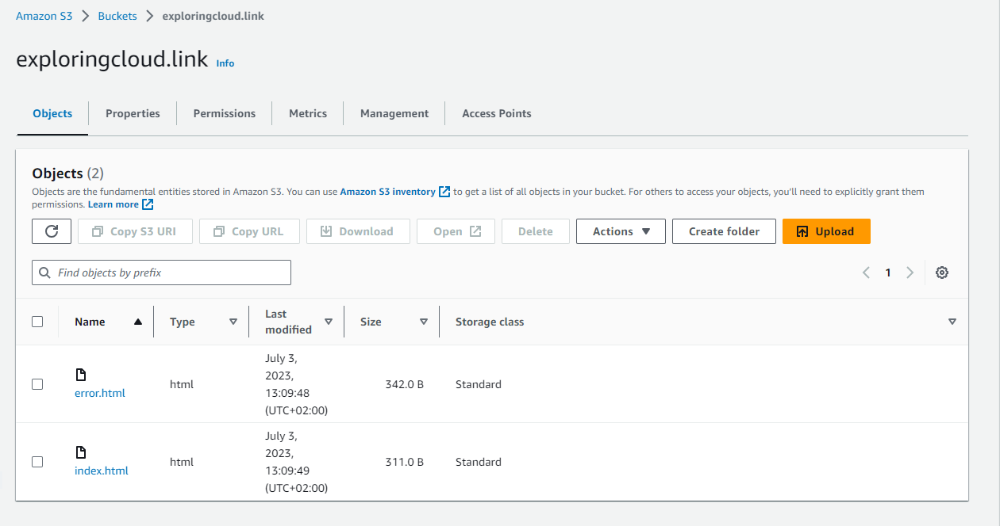
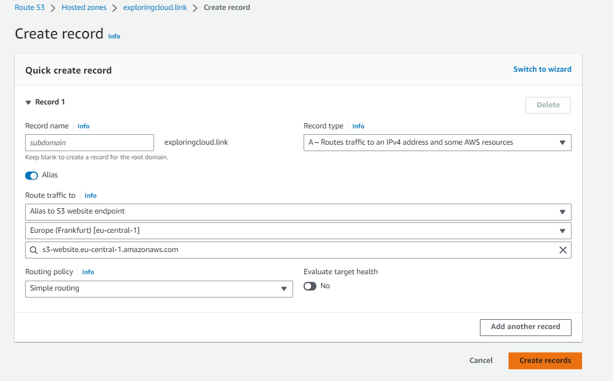
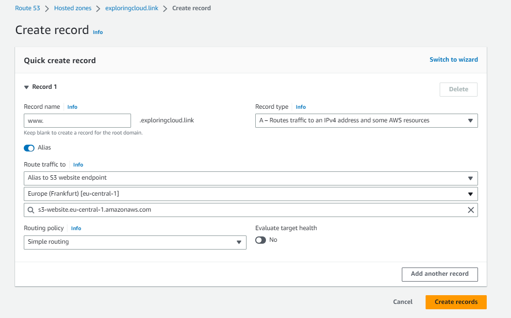
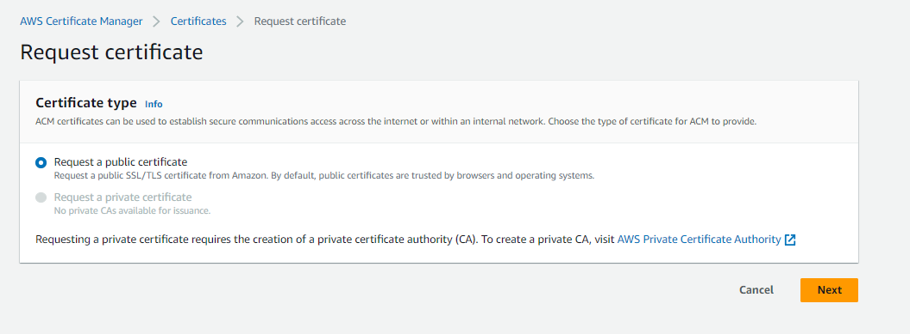
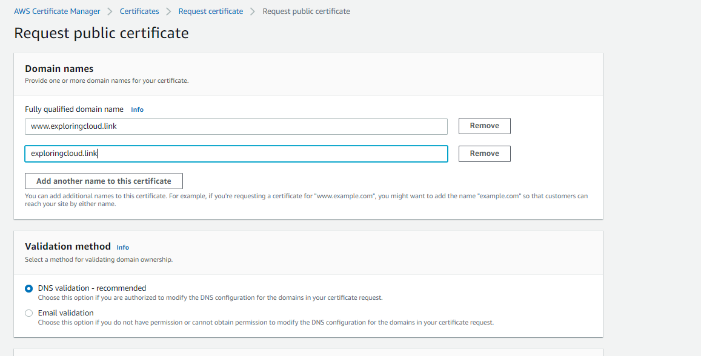
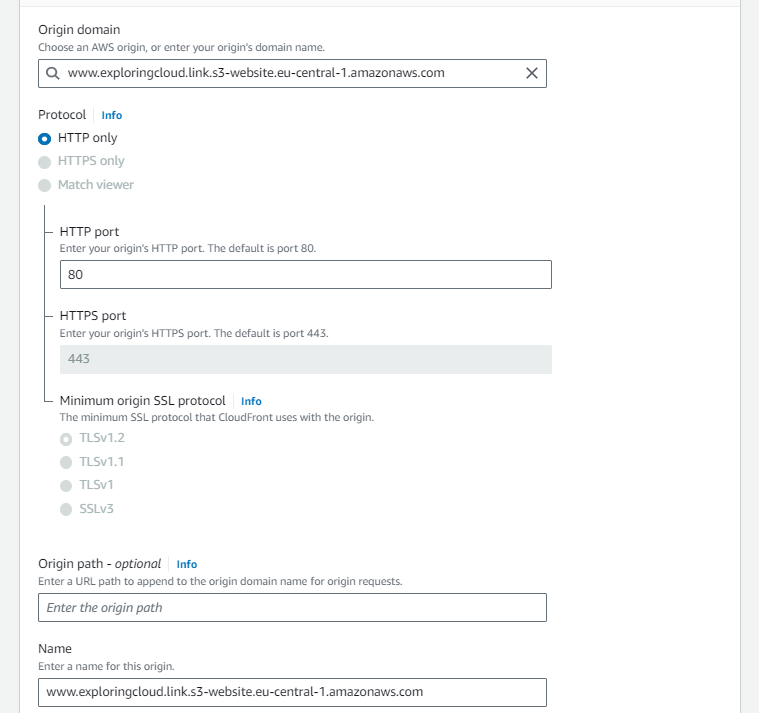
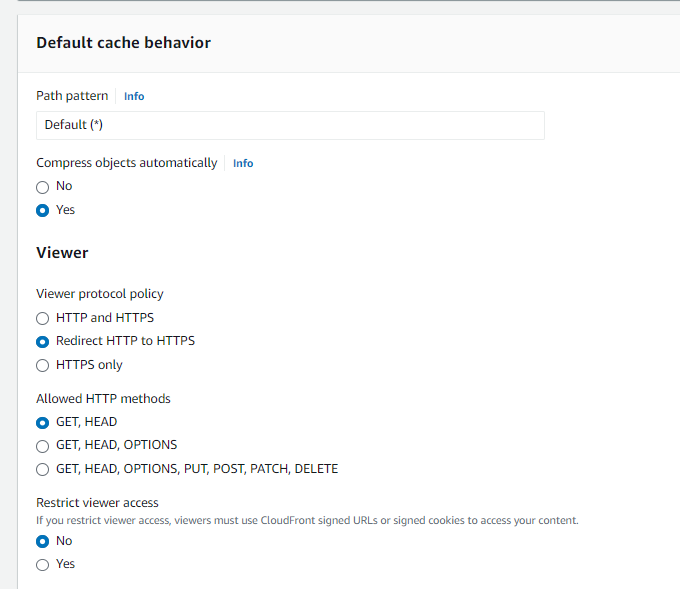
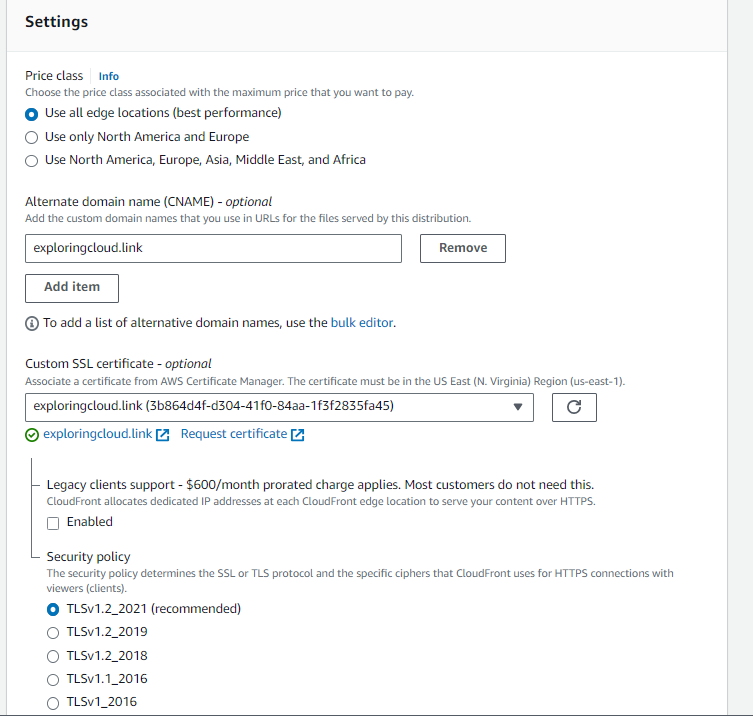
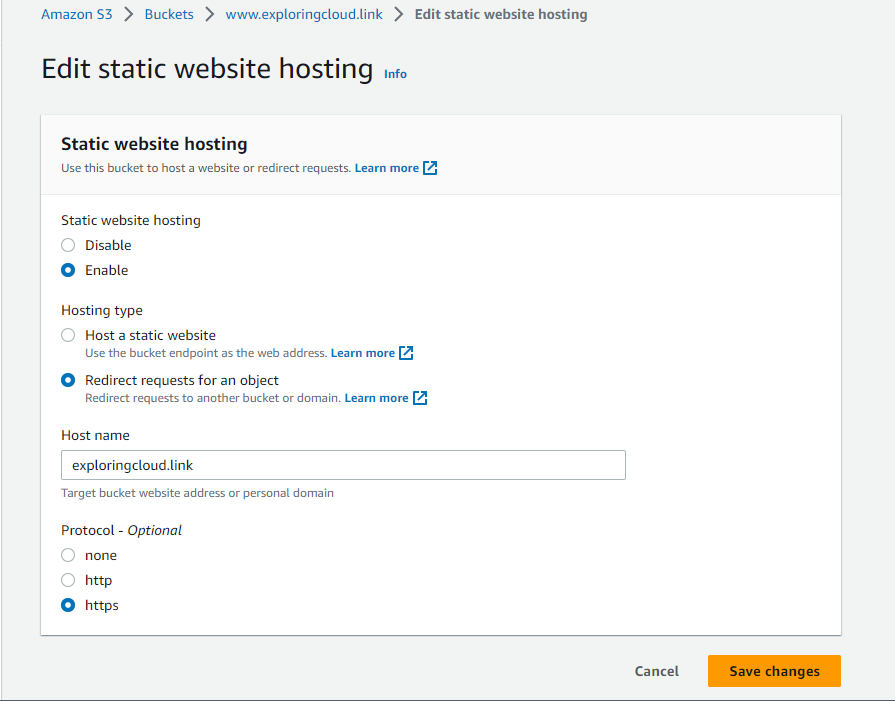

Project Description: Hosting a static website on AWS with Route 53

Technologies used: Route 53, CloudFront, S3 Bucket, AWS Certificate Manager

Section 1: Registering a domain name 
To host a website the first you need a domain name in order to access the website securely

1. Amazon Route 53 is a highly available and scalable Domain Name System (DNS) web service. Route 53 connects user requests to internet applications running on AWS or on-premises.
2. This blog provides detailed steps for registering a domain name with Route 53 [https://docs.aws.amazon.com/Route53/latest/DeveloperGuide/domain-register.html]

Section 2: Create a hosted zone 
A hosted zone is a container for records, and records contain information about how you want to route traffic for a specific domain, such as example.com, and its subdomains (acme.example.com, zenith.example.com).

1. When you purchase a domain name with Amazon Route 53, a hosted zone is automatically created for you.
2. Keep in mind that there is a small cost of 0.50$ per month for this service

Section 3: Create S3 buckets to store our static website files 
Important: Users generally access websites like amazon.com or www.amazon.com, so how do we make sure that our website is reachable with either of the address.
Simple, We can create 2 S3 buckets main public bucket with contents of the website and the other will be a redirection bucket which will redirect the queries to the main bucket

1. Navigate to S3 and choose create bucket, under bucket name create the bucket name same as the website you are hosting in my case (exploringcloud.link)
  
2. Allow this bucket to be publically available on the internet for time being, and edit the bucket policy to allow reads on your bucket
3. Now scroll to the bottom and create your bucket, once done upload all your files for the static bucket here:

4. You see properties on the above page, click on that scroll to the bottom of the screen under website hosting select edit, then enable website hosting and at last select index and error document as index.html and error.html respectively before saving changes

6. Follow the same steps for your redirection bucket (www.exploringcloud.click) and dont enable public access on this bucket (Note: This is just a redirection bucket, no need of object upload)
7. And at last for permission > static website hosting, enable website hosting and this time select redirect request for an object and hostname as your main bucket name

8. Now get the url of both the buckets from here and see if are able to access your website

Section 4: Now its time to access our website with Route 53 
1. Now its time to create DNS records (A records), which will allow you to redirect the traffic received to an IPV4 address, in this case our S3 buckets
2. Navigate to Route 53, click on Hosted zone and click on create records, now you want to route your traffic to the main bucket exploringcloud.link
4. Keep the record name blank, select A record as the record type
5. Route traffic to select a S3 website endpoint in the region where your bucket is located and select the bucket that is automatically displayed in this section
6. Keep the route policy as simple routing and select no for evaluate health since the website is hosted on s3

6. Similarly create another record for reroute s3 bucket and this time keep update the record name with www
7. Rest of the configuration is same, make sure you select the right bucket

Once the second record is created, wait again for several minutes before checking if your website is accessible via the web redirect address:

Section 5: Securing the Website
1. Now you might have noticed that the website says not secure to resolve this we have a simple solution, we can create a SSL certificate for our domain using AWS Certificate Manager
2. To request a certificate, navigate to AWS certificate manager and click on the orange button to request certificate.
     
4. Now request a public certificate and click next, when applying for a SSL certificate you are asked to provide a fully qualified domain name
5. We have 2 FQDN's (www.exploringcloud.link, exploringcloud.link), fill your FQDN under Domain name
7. Next you choose a validation method, proving that the domain your are creating is your own, I am choosing DNS validation, scroll at the  bottom and select Request
  
9. The certificate is created but not yet validated, Now in the configuration of the certificate you have to add two DNS records of type CNAME in your hosted zone , good news is AWS takes care of all this for you
10. All you have to this is select "create Records in Route 53" option then select the two FQDN's and hit create record
11. AWS has now filled in the CNAME reords for you, Wait for few minutes now untill you see success status and verify it by moving to your hosted zone

Section 6: Create cloudfront distribution:
Using cloudfront you will be able to deploy your website in HTTPS and get the benefits of Faster access to content using edge locations

1. Naviagate to CloudFront service and select create cloudfront distribution
2. On the create distribution page, for origin domain name copy the Bucket URL into properties tab, static website hosting section (highlighted in blue):
   
3. Disbale Origin Shield to avoid any charges.
4. Now make sure the configuration looks like this:
   
5. The default cache behaviour window should look like this and keep remaining settings as default:
   
6. Disable WAF security protection to incur any charges
7. Head over to securuty section and select the price class based on your use case
8. Fill int the Alternate domain name by inserting your main domain name
9. In the custom SSL certificates field, select the newly created certificate and leave the legacy client support unselected
   

   Keep all the settings as default, review your changes and create distribution
10. Similarly create a distribution for redirection bucket and change the origin domain name and Alternate domain name
11. Your cloud Front distributions will be run up and running in another 5-10 minutes
12. Meanwhile your CF distributions are created head over to your redirect S3 bucket and change the protocol from HTTP to HTTPS
    

Section 7: Lets access our website through cloudfront distribution
1.
 

